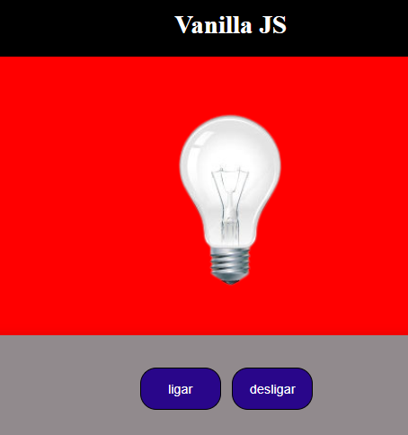

# Mini projetos vanilla JavaScript

### 01-To do List

### 02- Lampada

Altera a source da imagem com o evento do mouse, utilizando o metodo addEventListener()

#### Temas abordados

- addEventListener()
  - mouseout
  - mouseover
  - click
  - dblclick

 
